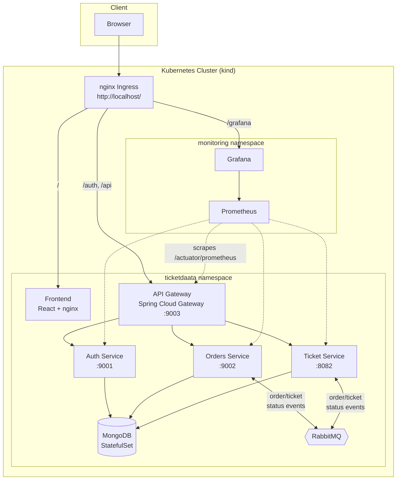

# TicketDaata

[](https://github.com/AASani29/TicketDaata/actions/workflows/ci-cd.yml)


A ticket resale marketplace built as a Spring Boot microservices system, deployed to Kubernetes with autoscaling, a GitHub Actions CI/CD pipeline publishing to GHCR, and a Prometheus/Grafana observability stack — end to end, from `git push` to a running, monitored cluster.

Users list tickets for sale, browse and buy them, and sellers approve or reject incoming orders. A reservation holds the ticket for 15 minutes while payment is simulated, with automatic expiry if it isn't completed in time.

## Architecture



Service-to-service calls resolve through Kubernetes Service DNS (`auth-service.ticketdaata.svc.cluster.local`, etc.) — no separate service registry. An earlier revision used Netflix Eureka (`ServiceRegistry/`, kept in the repo as a record of that design but no longer deployed); see [`k8s/README.md`](k8s/README.md#architecture-change-eureka--kubernetes-native-discovery) for the full before/after reasoning.

## Tech stack

| Layer | Technology |
|---|---|
| Backend | Java 17, Spring Boot 3.5, Spring Cloud Gateway (reactive), Spring Security, Spring Data MongoDB, Spring AMQP, JWT (jjwt) |
| Frontend | React 19, TypeScript, Vite, TailwindCSS, TanStack Query, Axios |
| Data & messaging | MongoDB, RabbitMQ |
| Containerization | Docker (multi-stage builds, non-root runtime users) |
| Orchestration | Kubernetes (kind locally), Kustomize, HPA (CPU-based autoscaling), nginx Ingress |
| CI/CD | GitHub Actions — Maven test matrix, frontend lint/build, kustomize manifest validation, Docker build & publish to GHCR |
| Observability | Prometheus (metrics scraping), Grafana (golden-signals dashboard) |

## Features

- **JWT authentication** — registration/login, BCrypt password hashing, stateless token validation at the gateway.
- **Ticket marketplace** — sellers list tickets (`AVAILABLE` → `RESERVED` → `SOLD`); buyers browse and purchase.
- **Order lifecycle with TTL reservations** — placing an order reserves the ticket for 15 minutes (`PENDING` → `APPROVED`/`CANCELLED`); a scheduler expires unconfirmed reservations automatically and releases the ticket back to `AVAILABLE`.
- **Event-driven status sync** — Orders and Ticket services communicate ticket/order state changes over RabbitMQ (with an in-memory fallback mode for dependency-free local runs — see `messaging.mode` in each service's `application.yml`).
- **Horizontal autoscaling** — every service has an HPA that reacts to real CPU metrics via `metrics-server`.
- **Zero-downtime verified** — killing a running pod doesn't interrupt traffic; the Service keeps routing to the remaining replica while Kubernetes replaces the dead one (see [`k8s/README.md`](k8s/README.md) for the exact command to prove it).

## Repository structure

```
APIGateway/       Spring Cloud Gateway — routes, circuit breakers, JWT-aware proxying
AuthService/      Registration/login, JWT issuance, MongoDB-backed users
OrdersService/    Order lifecycle, TTL reservation expiry, RabbitMQ publisher/listener
ticketservice/    Ticket CRUD, status transitions, RabbitMQ publisher/listener
Frontend/         React + Vite SPA, served by nginx in its own container
ServiceRegistry/  Legacy Eureka server — kept for history, not deployed
k8s/              Kubernetes manifests (Kustomize): app, mongo, rabbitmq, monitoring
.github/workflows/ CI/CD pipeline definition
```

## Running it

**Kubernetes is the primary, supported path** — see **[`k8s/README.md`](k8s/README.md)** for the full walkthrough (cluster creation, image build/load, ingress-nginx + metrics-server setup, deploy, and how to reach the app and Grafana).

```bash
kind create cluster --name ticketdaata --config k8s/kind-cluster-config.yaml
# build + load images, install ingress-nginx & metrics-server — see k8s/README.md
kubectl apply -k k8s/
```

Then open `http://localhost/` for the app and `http://localhost/grafana/` for dashboards.

For plain local development without Kubernetes, `start-services.bat` runs each service directly via `mvnw spring-boot:run`, resolving other services over `localhost` by default. `docker-compose.yml` optionally provides a local RabbitMQ; each service can also run with `messaging.mode: inmemory` (no broker needed) or `messaging.mode: rabbitmq`, and needs a reachable MongoDB either way (local install or `MONGODB_URI` pointed at Atlas).

## CI/CD

Every push and PR runs a Maven test/build matrix across the four Spring Boot services, lints and builds the frontend, and validates the Kubernetes manifests with `kubectl kustomize`. Pushes to `main` additionally build and publish all five service images to GHCR (`ghcr.io/aasani29/ticketdaata-*`), tagged with both `latest` and the commit SHA. See [`.github/workflows/ci-cd.yml`](.github/workflows/ci-cd.yml).

## Observability

Prometheus scrapes `/actuator/prometheus` on all four Spring Boot services; Grafana ships with a pre-provisioned "TicketDaata - Golden Signals" dashboard (request rate, p95 latency, JVM heap, CPU usage, target health) — no manual setup required after `kubectl apply -k k8s/`. Full details, access URLs, and known limitations are in [`k8s/README.md`](k8s/README.md#observability-prometheus--grafana).

## Security note

Earlier revisions of this repo had a real MongoDB Atlas username/password committed in plaintext in `AuthService`, `OrdersService`, and `ticketservice`'s `application.yml`. Those are gone from the current tree (config is now env-var driven, see each service's `application.yml` and the `k8s/` Secrets), but removing them from the tree doesn't erase git history — if you fork this or reuse that Atlas cluster, rotate the credential.

## Roadmap

- Helm chart (the `k8s/` manifests are plain Kustomize today).
- k6 load testing, to actually drive traffic and watch the HPAs scale in real time.
- Broader unit/integration test coverage (currently only smoke-level `contextLoads` tests on two of the four services).
